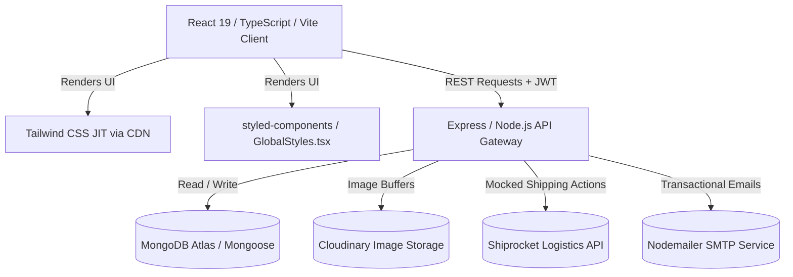

# TANVO — Complete AI Instruction & Project Context Report

This document serves as a comprehensive technical blueprint and prompt-context report for the **TANVO** project. It is structured specifically to provide any AI assistant or developer with an immediate, thorough, and highly accurate understanding of the project's identity, tech stack, codebase structure, schema design, current implementation status, and active roadmap.

---

## 1. System Prompt & Context for AI Assistants

> [!NOTE]
> **Instructions for the AI:**
> You are the Senior AI Architect and Lead Engineer for **TANVO**. When developing features, fixing bugs, or refactoring this codebase, you must adhere to the following principles:
> 1. **Luxury & Heritage First:** TANVO is a premium, heritage-focused handloom platform, not a generic store. Visuals must be elegant (using the curated color palette and smooth transitions), and product storytelling (weavers, generational history, craftsmanship) must remain front and center.
> 2. **Hybrid Styling System:** The application uses a hybrid of `styled-components` for global layouts/heritage sections and `Tailwind CSS` for quick component building. Make sure utilities are styled cleanly.
> 3. **Clean Controller Patterns:** The Express backend isolates database logic inside controllers, keeping routing files strictly for endpoint mapping and middleware validation.
> 4. **No Placeholders:** When adding features, write production-grade logic. Ensure robust error handling, JWT validation, and database transaction checks.

---

## 2. Brand Positioning & Domain Context

**TANVO** is a high-end, storytelling-led e-commerce platform dedicated to authentic handloom clothing and regional crafts from Odisha (such as Sambalpuri, Bomkai, Ikat, Khandua, and Sonepuri weaves). 

Unlike a generic marketplace, the brand focuses on:
- **Artisan Stories:** Displaying details about the weaver (generation, location, and the background story behind each individual weave).
- **Authenticity & Trust:** GI-certified products, highlighting fabric types (Silk, Cotton, Tussar, Matka, Linen).
- **Premium Experience:** Beautiful cinematic scroll animations, elegant warm ivory colors, and direct WhatsApp inquiry panels for custom requirements.

---

## 3. Technology Stack & Architecture

TANVO is built using a split-tier React-Express architecture:



### Key Libraries & Versions
- **Frontend (`package.json`):**
  - Core: React 19.2.3, React DOM 19.2.3, React Router Dom 7.13.0 (currently using `HashRouter`).
  - Styling: `styled-components` 6.3.11, `tailwindcss` 3.4.17 (imported in index.html as a runtime CDN, but setup for build-time compilation), `clsx` 2.1.1, `tailwind-merge` 3.5.0.
  - Animations: `framer-motion` 12.34.2.
  - Utilities: `lucide-react` (icons), `react-barcode` (POS barcode rendering), `react-swipeable` (mobile touch inputs), `html2canvas` & `jspdf` (receipt generation).
- **Backend (`package.json`):**
  - Framework: `express` 4.18.2, `mongoose` 7.5.0 (MongoDB ODM).
  - Security: `bcryptjs` (password hashing), `jsonwebtoken` (JWT creation/validation), `helmet` (security headers), `express-rate-limit` (API rate limits).
  - Middleware: `multer` (multipart uploads), `cors` (CORS settings), `morgan` (dev logging), `compression` (gzip).
  - Third-Party Services: `cloudinary` 2.9.0, `nodemailer` 8.0.1, `stripe` 14.5.0, `razorpay` 2.9.2, `shiprocket-sdk` 1.0.1.

---

## 4. Codebase Directory Mapping

### Frontend Directory Structure (`/frontend`)
```
frontend/
├── index.html            # Main HTML entry. Imports Tailwind via CDN <script>.
├── App.tsx               # App entry, router layout, and route definitions.
├── index.tsx             # React DOM mounting file.
├── tailwind.config.js    # Custom brand config.
├── types.ts              # Global TypeScript interfaces.
├── context/
│   ├── AuthContext.tsx   # Holds current user state, login/logout, JWT storage.
│   └── StoreContext.tsx  # Handles cart, wishlist, products, orders, guest cart merging.
├── pages/
│   ├── Home.tsx          # Homepage with cinematic scroll sections.
│   ├── Shop.tsx          # E-commerce store with filters (fabric, weave, price).
│   ├── ProductDetail.tsx # Rich detail view with weaver stories & heritage descriptions.
│   ├── Auth.tsx          # Combined Login / Register page with guest-cart merging.
│   ├── Checkout.tsx      # Checkout page with shipping forms and payment selectors.
│   ├── admin/
│   │   ├── Billing.tsx   # Offline POS terminal for retail billing.
│   │   ├── AdminDashboard.tsx # Store metrics & analytics.
│   │   └── AdminProducts.tsx # Product inventory manager.
│   └── auth/             # Forgot password, reset password, email verification pages.
└── components/
    ├── Navbar.tsx        # Responsive navigation with live cart counters.
    ├── Footer.tsx        # Brand footer.
    └── GlobalStyles.tsx  # Global styled-components variables & typography definitions.
```

### Backend Directory Structure (`/backend`)
```
backend/
├── src/
│   ├── server.js         # Entry point. Sets up express, database connection, middleware.
│   ├── config/
│   │   └── database.js   # Mongoose database connection client.
│   ├── controllers/      # Business logic (authController, productController, orderController, etc.).
│   ├── middleware/       # JWT auth middlewares, error handlers, upload helpers.
│   ├── models/           # Mongoose ODM Schemas.
│   ├── routes/           # Express router endpoints mapping to controllers.
│   └── utils/            # Helper classes for email, payment, and shiprocket.
├── seed.js               # Database seeder script with product catalogue.
└── package.json          # Node scripts and server dependencies.
```

---

## 5. Mongoose Database Schema Specifications

### `User.js`
Stores customer credentials, active delivery addresses, and user roles (`customer` or `admin`).
- **Fields:** `name` (String), `email` (String, unique), `password` (String, hashed), `role` (String: customer/admin), `addresses` (Array of nested Address subdocuments), `isVerified` (Boolean), `verificationToken` (String).

### `Product.js`
Contains details of the handloom clothing catalog, including rich heritage storytelling metadata.
- **Fields:**
  - `name` (String), `slug` (String, slugified from name), `description` (String), `shortDescription` (String).
  - `price` (Number), `originalPrice` (Number, for crossed-out discount calculations).
  - `category` (String: Women/Men/Accessories/Home Decor), `subCategory` (String: Sarees, Kurtis, Dhoti, Kurta, etc.).
  - `weave` (String: Sambalpuri, Bomkai, Ikat, Khandua, Pasapali, Sonepuri).
  - `fabric` (String: Silk, Cotton, Tussar, Matka, Linen, Muslin).
  - `images` (Array of `{ url, publicId, isPrimary }` from Cloudinary).
  - `stock` (Number), `colors` (Array of Strings), `sizes` (Array of Strings).
  - `weight` (Number), `dimensions` (length, width, height for Shiprocket pricing).
  - `metaTitle` (String), `metaDescription` (String) for SEO.
  - `weaverInfo` (Object: `{ name, generation, location, story }` for artisan storytelling).

### `Order.js`
Manages purchase records, tracking data, and integrations for billing and fulfillment.
- **Fields:**
  - `user` (ObjectId ref to User).
  - `orderItems` (Array of `{ product, name, quantity, price, image, color, size }`).
  - `shippingAddress` (Address object).
  - `paymentMethod` (String: COD, CARD, UPI, NETBANKING, WALLET).
  - `paymentResult` (Object: `{ id, status, update_time, email_address }` from Razorpay/Stripe).
  - `itemsPrice`, `taxPrice` (5% GST), `shippingPrice` (free above ₹5000, otherwise ₹500), `discountPrice`, `totalPrice` (Number fields).
  - `orderStatus` (String: Pending, Processing, Shipped, Delivered, Cancelled, Refunded).
  - `paymentStatus` (String: Pending, Paid, Failed, Refunded).
  - `shiprocketOrderId` (String), `shiprocketShipmentId` (String), `awbNumber` (String) for logistics tracking.
  - `trackingStatus` (String), `trackingHistory` (Array of Objects).

### `Cart.js`
Maintains user-specific shopping carts in the database, allowing guest carts to sync post-login.
- **Fields:** `user` (ObjectId ref to User), `cartItems` (Array of `{ product, quantity, color, size }`).

---

## 6. Implementation Matrix & Current Maturity

| Feature | Completion | Details |
| :--- | :---: | :--- |
| **Hero Cinematic Animations** | 🟢 100% | High-fidelity Framer Motion visual transitions in `Home.tsx` and `About.tsx`. |
| **Guest Cart Merging** | 🟢 100% | Client merges local/guest storage data into database account on login/signup. |
| **Artisan Storytelling** | 🟢 100% | Rich detail views showing weaver details, locations, and fabric heritage. |
| **Offline Retail POS** | 🟢 90% | Collapsible billing screen supporting live barcode scan entries, manual product searches, thermal receipt formatting, and PDF downloads. |
| **Cloudinary Integration** | 🟢 100% | Image stream uploads via Multer memory buffers directly into Cloudinary folders. |
| **Payment Gateway** | 🔴 20% | Stripe and Razorpay npm packages exist in package.json, but logic in `Checkout.tsx` bypasses gateway payments directly to completed orders (effectively treating all orders as Cash on Delivery). |
| **Logistics (Shiprocket)** | 🟡 40% | Core fields exist in models. The client-facing SDK is broken; backend currently uses hardcoded mock deliveries. A direct REST client must replace the broken SDK. |
| **SEO & Routing** | 🟡 50% | Running under client-side `HashRouter`. This impedes search engine crawlers from indexing weaver logs and catalog detail pages. Needs migration to clean server-supported routing. |
| **Tailwind Compilation** | 🟡 50% | Tailwind is running via a client-side CDN script tag. Leads to FOUC (Flash of Unstyled Content) and bundle size bloating. Needs build-time compilation. |

---

## 7. Development Patterns & Code Guidelines

### Styling & Visual Palette
TANVO utilizes a premium, luxury layout defined in `GlobalStyles.tsx` using CSS variables:
- **Ivory Main Background:** `var(--bg-main)` (`#F9F5EE`)
- **Primary Ink/Text:** `var(--text-primary)` (`#0D0B0A`)
- **Terracotta Accent:** `var(--action-cta)` (`#B5502B` / `#B43F3F`)
- **Sage/Warm Accents:** `var(--warm)` (`#173B45` / `#FF8225`)

### Authentication & Merging Flow
1. User logs in/registers using email/password.
2. If the user had cart items saved locally as a guest, `mergeGuestData()` is triggered.
3. This appends local items into the database-backed cart and updates the application state.
4. JWT token is stored inside the context header, protecting paths like `/profile`, `/orders`, `/checkout`, and `/admin`.

---

## 8. Prioritized Launch Roadmap

### Phase 1: Real Payments Integration (Stripe & Razorpay)
- Hook up Razorpay SDK popup on frontend checkout buttons.
- Create `/api/payments/webhook` securely validated using gateway signing secrets.
- Verify payment status prior to reducing product inventory.

### Phase 2: Direct Shiprocket API Integration
- Remove the unstable `shiprocket-sdk` package.
- Write a direct REST client inside `backend/src/utils/shiprocket.js` using `axios`.
- Fetch real shipping serviceability using customer's pincode and product weight/dimensions.
- Connect label generation, order dispatch, and live webhook tracking events.

### Phase 3: Tailwind purging & SEO Routing
- Implement build-time Tailwind CSS compiler via PostCSS.
- Remove `<script src="https://cdn.tailwindcss.com"></script>` from `index.html`.
- Migrate frontend `HashRouter` to standard `BrowserRouter`, configuring wildcard fallbacks on hosting servers (Vercel/Render/Nginx) to support clean URLs for weaver stories and product slugs.

### Phase 4: Production Polish
- Implement robust stock checking on backend `checkout` controllers to prevent race conditions during high-volume drops.
- Polish the Admin Billing page with filterable items and out-of-stock indicators.
- Finalize environment configuration documentation.
