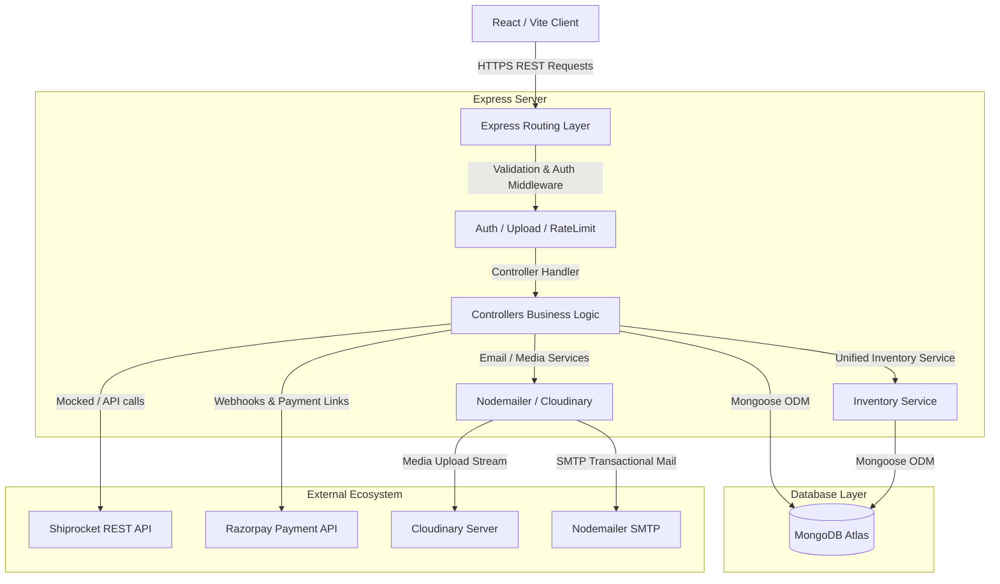

# Architecture Audit: TANVO Platform

**Date:** July 15, 2026  
**Auditor:** Senior Software Architect / CTO Auditor  
**Scope:** Architectural Audit, Data Schemes, & Third-Party APIs  

---

## 1. System Architecture Overview

The TANVO platform is structured as a monolithic monorepo. It features a client-server architecture with separation of concerns between the client interface, API routing layer, controller business logic, and MongoDB database storage.



### Monorepo Structure Layout
* `/frontend`: Houses the single-page application built on React 19. It communicates via Axios with the API server. State management is primarily centralized in a React Context hook (`StoreContext.tsx`).
* `/backend`: Configured as an Express API Gateway. Follows the model-view-controller (MVC) architectural pattern, keeping server entry (`server.js`), API routes (`/src/routes`), database models (`/src/models`), middleware interceptors (`/src/middleware`), and service scripts (`/src/services`) separated.

---

## 2. Database Schema & Data Relationships

The database is built on MongoDB Atlas, managed on the server side using the Mongoose Object-Document Mapper (ODM). Relational database integrity is maintained through Mongoose schema configurations.

### Schema Catalog and Audit

#### 1. `User.js`
* **Role:** Stores user profiles, credentials, role-based access levels (RBAC), and customer addresses.
* **Audit Assessment:** Address book is modeled as an array of nested subdocuments containing location fields (`addressLine1`, `city`, `state`, `pincode`, `phone`). Password security is enforced through a pre-save hook that hashes passwords using `bcryptjs` with 10 salt rounds. Last-login dates are tracked.

#### 2. `Product.js`
* **Role:** Product catalog metadata, pricing details, and weaver biographies.
* **Audit Assessment:** Implements virtual schemas for `discountPercentage` calculations. Pre-save hooks automatically generate search-friendly slugs. Contains deep weaver data structures (`weaverInfo`) linking products to specific artisan profiles. Optimized for querying with compound indexes on `{ category: 1, weave: 1 }` and standalone indexes on `createdAt` and `isBestSeller`.

#### 3. `Order.js`
* **Role:** Logs transactional e-commerce sales.
* **Audit Assessment:** Links order items directly to `Product` and uses a relational field referencing the purchasing `User`. Tracks logistics properties (`shiprocketOrderId`, `awbNumber`, `trackingStatus`) and payment metrics. Features a pre-save hook to automatically calculate `itemsPrice` totals before committing documents.

#### 4. `Cart.js`
* **Role:** Shopping cart persistence.
* **Audit Assessment:** Simple object array storing `product` references, quantitites, and selected color/size variants. Automatically updated when users modify cart items.

#### 5. `Review.js`
* **Role:** Verified buyer reviews.
* **Audit Assessment:** Relational schema referencing both `User` and `Product`. Features status fields (`approved`, `pending`, `rejected`) for moderation workflows.

#### 6. `Coupon.js`
* **Role:** Active promotional code controls.
* **Audit Assessment:** Manages code strings, discount variables (percentage or flat currency deductions), validity limits, and activation states.

#### 7. `InventoryLog.js`
* **Role:** Comprehensive inventory adjustment ledger.
* **Audit Assessment:** Records stock movements (Website, WhatsApp, Offline POS) with type definitions (`SALE`, `RESTOCK`, `RETURN`, `ADJUSTMENT`) to maintain a clear audit trail.

#### 8. `WhatsAppOrder.js`
* **Role:** Manual CRM orders.
* **Audit Assessment:** Features a pre-save sequence linked to a counter collection (`WACounter`) to generate sequential IDs (e.g. `WA-1001`). Calculates cost pricing, margins, net profits, and tracks screenshot uploads for manual payment verification.

#### 9. `WACustomer.js`
* **Role:** CRM contact database.
* **Audit Assessment:** Tracks phone numbers, address history, lifetime values (LTV), and transaction records for customers placing orders via WhatsApp.

### Entity Relationship Diagram (ERD)

```mermaid
erDiagram
  USER ||--o{ ORDER : places
  USER ||--o{ REVIEW : writes
  USER ||--o[ CART : owns
  PRODUCT ||--o{ ORDER_ITEM : contained_in
  PRODUCT ||--o{ REVIEW : receives
  ORDER ||--o{ ORDER_ITEM : contains
  WA_CUSTOMER ||--o{ WHATSAPP_ORDER : owns
  WHATSAPP_ORDER }|--|{ PRODUCT : contains
  PRODUCT ||--o{ INVENTORY_LOG : logs
```

---

## 3. Route & Middleware Architecture

API gateways follow REST patterns inside `backend/src/routes`. Protection and requests are verified through Express middleware:

* **Authentication (`auth.js`):** Intercepts requests by verifying JWT headers (`Authorization: Bearer <token>`). Populates `req.user` with user metadata, excluding passwords. Exports an `admin` role-check utility (`req.user.role === 'admin'`) to restrict management endpoints.
* **Input Validation (`express-validator`):** Routes like `authRoutes.js` run parameter integrity checks before executing controllers (e.g., checking if email strings are valid and password inputs are at least 6 characters).
* **Security Headers & Rate-Limiting:** Express apps are hardened using `helmet()` middleware. API calls are rate-limited to 100 requests per 15-minute window via `express-rate-limit`.
* **File Uploads (`upload.js`):** Configures Multer to store incoming file buffers in memory. Images are streamed directly to Cloudinary folder locations.

---

## 4. Integration Analysis & API Boundaries

The integration tier handles third-party APIs:

### 1. Cloudinary
* **Scope:** Completed and fully functional.
* **Data Flow:** Multer parses file streams on the server, which are then passed directly to Cloudinary's dynamic upload endpoints. The secure asset URL is returned and saved in database schemas.

### 2. Nodemailer
* **Scope:** Completed and fully functional.
* **Data Flow:** Sends transactional HTML emails using SMTP servers. Preconfigured for:
  * Welcoming new users (`sendWelcomeEmail`)
  * Verifying registration links (`sendVerificationEmail`)
  * Confirming order placements (`sendOrderConfirmation`)
  * Recovering passwords (`sendPasswordResetEmail`)

### 3. Razorpay Payments
* **Scope:** Partially completed (Sandbox/Mock mode active).
* **Endpoint Mappings:** Includes order creation routes (`/api/orders/razorpay/create`) and cryptographic verification routes (`/api/orders/razorpay/verify`).
* **Integration Status:** Lacks live credentials (`RAZORPAY_KEY_ID`, `RAZORPAY_KEY_SECRET`), defaulting to local sandbox simulation for orders.

### 4. Shiprocket Logistics
* **Scope:** Partially completed (Mock mode active).
* **Data Flow:** Direct REST client calls are managed in `shiprocket.js` to handle token generation and serviceability checks.
* **Integration Status:** Due to missing credentials, it automatically falls back to sandbox placeholders (`mock_shiprocket_id`).

---

## 5. Corporate Identity & Compliance Audit

### Parent Entity Metadata Config (`corporateConfig.ts`)
The client configuration establishes a centralized source of truth for the corporate structure. `SYS Pvt. Ltd.` is configured as the parent entity, with `TANVO`, `TwoThreads Studio`, and `SABLE` registered as sister brands under its portfolio.

### Compliance Integration
* **Footer:** Displays "A Brand by SYS Pvt. Ltd." beneath legal links in a muted style, ensuring brand hierarchy.
* **About / Story:** Integrates a corporate family history section outlining TANVO's parent organization without overshadowing its artisan narrative.
* **Legal Policy Pages:** Privacy policy, terms, cookies, shipping, and returns pages explicitly list `SYS Private Limited` as the legally responsible entity.
* **Invoices:** Invoices dynamically reference `SYS Pvt. Ltd.` as the legal corporate entity alongside the primary `TANVO` consumer brand, complying with billing regulations.
* **Email Signatures:** The email server appends legal entity disclosures to transaction confirmations.
