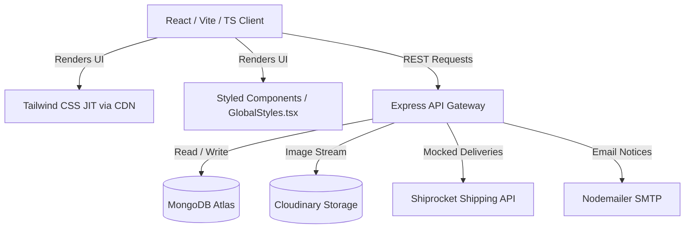
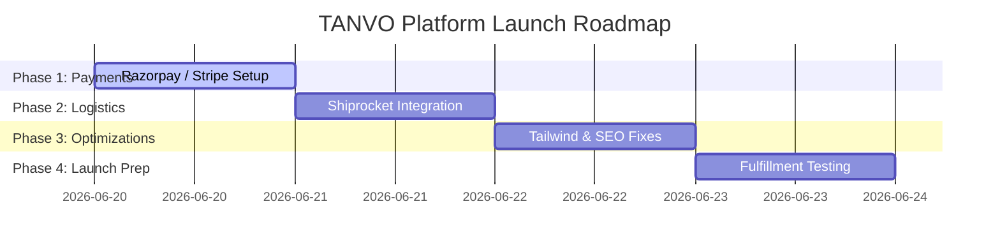

# TANVO — Current Situation Audit & Technical Report

**Audited on June 19, 2025**  
**Role:** Senior Startup CTO & E-commerce Architect

---

# 1. Executive Summary & Brand Positioning

TANVO is designed as a premium, heritage-focused e-commerce platform for handloom clothing and regional crafts (Odisha sarees, kurtas, ethnic wear, and weaver stories).

It stands out from generic stores by integrating:

- Artisan-focused branding
- GI-certified weaver logs
- Personal storytelling
- Heritage-driven shopping experience

---

## Current Maturity Level

| Area                                  | Completion | Status                                                                                                                                                                                                |
| ------------------------------------- | ---------: | ----------------------------------------------------------------------------------------------------------------------------------------------------------------------------------------------------- |
| **Frontend (React/TypeScript/Vite)**  |       ~75% | High-fidelity UI, visual design system, and storytelling animations are complete. Critical e-commerce flows like payments, live shipping estimation, and search indexing remain incomplete or mocked. |
| **Backend (Node.js/Express/MongoDB)** |       ~65% | Core APIs for orders, carts, and profiles are stable. Payment capture, webhooks, and live shipping integrations are incomplete.                                                                       |
| **Admin Dashboard**                   |       ~50% | Refined offline retail billing panel with barcode scanning and invoice generation. Missing online logistics and customer management controls.                                                         |
| **Overall Project Maturity**          |   **~63%** | Pre-launch readiness stage                                                                                                                                                                            |

---

# 2. Architecture & Tech Stack

TANVO uses a split-tier architecture:



---

# Critical Tech Stack Risks

## 1. Tailwind CSS CDN JIT Compilation

The client-side `index.html` imports Tailwind through:

```html
<script src="https://cdn.tailwindcss.com"></script>
```

instead of compiling during the build process.

### Risk:

- Flash of Unstyled Content (FOUC)
- Increased browser loading latency
- Large production bundle size
- No proper CSS purging

---

## 2. Vite Client Routing (HashRouter vs BrowserRouter)

Current hash-based routing creates:

- Poor clean URL structure
- Reduced SEO indexing capability
- Problems indexing:
  - Weaver profiles
  - Product detail pages

---

# 3. Database Schema Audit

Database: **MongoDB Atlas**
ODM: **Mongoose**
Location: `backend/src/models`

| Model          | Primary Function                                            | Strengths                                                       | Risks & Gaps                                                   |
| -------------- | ----------------------------------------------------------- | --------------------------------------------------------------- | -------------------------------------------------------------- |
| **User.js**    | User credentials, roles, addresses                          | Structured address storage                                      | No coordinates or delivery validation flags                    |
| **Product.js** | Fabric details, weave type, colors, sizes, artisan profiles | Rich handloom metadata, weaver story, location, generation data | Missing SKU validation, search indexes, multi-currency pricing |
| **Order.js**   | Items, shipping, statuses, tracking                         | Shiprocket fields included (`shiprocketOrderId`, `awbNumber`)   | Missing payment references and return tracking                 |
| **Cart.js**    | User shopping carts                                         | Atomic item definitions                                         | No expired guest cart cleanup                                  |
| **Coupon.js**  | Discounts and expiry handling                               | Supports percentage and flat discounts                          | No user usage limits                                           |
| **Review.js**  | Ratings, text, images                                       | Supports review images                                          | No admin approval workflow                                     |

---

# 4. Frontend & Visual Audit

## Design System

**Luxury Warm Ivory + Terracotta Palette**

- `#F9F5EE`
- `#B5502B`

Represents:

- Indian heritage
- Handloom craftsmanship
- Premium ethnic identity

---

# Completed Visual Sections

## Hero Cinematic Animations

- Framer Motion transitions
- Premium storytelling effects
- Implemented in:
  - `Home.tsx`
  - `About.tsx`

---

## WhatsApp Inquiry Panel

Component:

```
WhatsAppOrder.tsx
```

Features:

- Direct artisan communication
- Customer inquiry workflow

---

## Shop Filtering System

Component:

```
Shop.tsx
```

Features:

- Fabric filtering
- Weave filtering
- Price range filtering
- Loading skeletons

---

## Offline POS Terminal

Component:

```
Billing.tsx
```

Features:

- Barcode scanning
- Offline checkout
- Thermal invoice generation

---

# Broken / Missing UX Gaps

## Payment Gateway

Current issue:

- Card / UPI selection bypasses payment
- Orders are immediately marked successful

---

## Search System

Current issue:

Navbar search:

- Client-side text matching only
- No fuzzy database search

---

## Customer Dashboard

Missing:

- Return requests
- Online cancellations
- Live order tracking

---

# 5. Backend & API Audit

The Express backend has clean controller architecture.

---

## Atomic Inventory Handling

`orderController.js`

Handles:

- Stock validation
- Inventory updates
- 5% GST calculation
- Shipping logic

Shipping:

- Free above ₹5,000
- ₹500 otherwise

---

## Dual Checkout Support

Supports:

- Database cart checkout
- Direct checkout requests

---

## Cloudinary Upload System

`upload.js`

Flow:

```
Multer Memory Buffer
        ↓
Cloudinary Stream Upload
        ↓
Stored Asset URL
```

---

# 6. Integration Audit

## 🔴 Payment Gateway (Stripe & Razorpay)

**Status:** NOT IMPLEMENTED

Current situation:

- Dependencies exist
- No payment processing logic
- All transactions behave like COD

---

## 🟡 Shiprocket Shipping

**Status:** MOCKED

Current situation:

- SDK marked broken
- Placeholder responses used
- Webhook exists but cannot receive real updates

---

## 🟢 Cloudinary & Email

**Status:** FUNCTIONAL

Working:

- Product image storage
- Profile images
- Transactional emails:
  - Welcome
  - Order confirmation
  - Admin alerts

---

# 7. Security & Authentication Audit

## Authentication

System:

- Custom JWT middleware
- Admin route protection

---

## Cart Synchronization

Working:

Guest cart → User account merge after login

---

# 8. Prioritized 4-Day Upgrade Plan



---

# Day 1 — Secure Online Payments & Order Flow

## Task

Integrate:

- Razorpay SDK
- Stripe Elements API

## Deliverables

1. Update checkout controller:

- Verify payments before inventory update

2. Add secure webhook handling:

```
/api/payments/webhook
```

Handles:

- Payment failure
- Cancellation
- Verification

3. Replace mock payment screen with real gateway popup

---

# Day 2 — Shipping Gateway Restoration

## Task

Restore Shiprocket integration.

## Deliverables

1. Replace broken SDK:

```
shiprocket-sdk
```

with direct REST API calls.

2. Implement:

- Real pincode checks
- Weight-based serviceability

3. Connect:

Order → Shipping Label → Tracking Number

---

# Day 3 — Build Optimization & SEO

## Task

Improve performance and search visibility.

## Deliverables

1. Replace runtime Tailwind CDN:

Before:

```
Browser Compilation
```

After:

```
Build-time Compilation
```

2. Add:

- Product metadata
- Dynamic titles
- SEO descriptions

3. Configure:

- Clean URLs
- Better indexing

---

# Day 4 — Testing & Admin Polish

## Task

Complete launch preparation.

## Deliverables

1. Test:

- Out-of-stock checkout
- Cart recovery
- Edge cases

2. Improve admin dashboard:

- Low stock filters
- Inventory quick search

3. Document:

- Environment variables
- API keys
- Production setup

```

```
