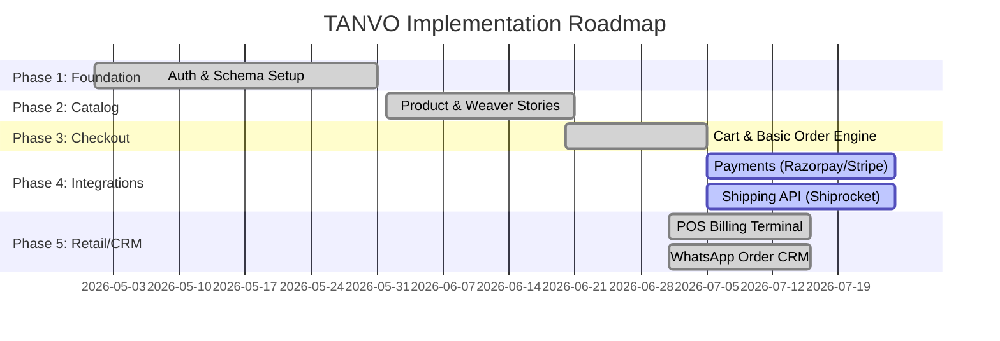

# Phase Completion Report: TANVO Platform

**Date:** July 15, 2026  
**Auditor:** Senior Software Architect / CTO Auditor  
**Scope:** Phase-by-Phase Roadmap Audit  

---

## 1. Roadmap Architecture Overview

The development of the TANVO e-commerce platform is divided into five implementation phases. This report maps the completed, partial, and pending components against this production-grade roadmap.

---

## 2. Phase-by-Phase Progress & Audit

### Phase 1: Core Foundation & Secure Authentication
**Status:** 100% Complete  
**Objective:** Set up the database, models, and authentication system.

*   **Database Schema Design:** Implemented relational Mongo collections using Mongoose (`User`, `Product`, `Order`, `Cart`, `Review`, `Coupon`, `WACounter`).
*   **User Authentication & Security:** Custom JWT auth implementation with cryptographically hashed passwords (`bcryptjs`).
*   **Address Management:** Embedded address arrays inside user documents.
*   **Role-Based Access Control (RBAC):** Middleware checks enforce permissions (e.g. restricting `/api/admin` to users with `role === 'admin'`).

### Phase 2: Product & Catalog Management
**Status:** 100% Complete  
**Objective:** Build out catalog browsing, filtering, and storytelling elements.

*   **Rich Search & Filters:** Product query endpoints support filtering by categories, weaves, fabrics, price ranges, and sorting.
*   **Artisan Storytelling (Weaver Biography):** Integrates artisan profiles, GI-weave details, and location metadata.
*   **SEO Metadata Structure:** Added fields for indexing and SEO (`metaTitle`, `metaDescription`, `metaKeywords`).
*   **Product Collections & Badging:** Configured attributes like `isFeatured`, `isBestSeller`, and `isNewArrival` with database indexing.

### Phase 3: Shopping Cart & Basic Order Engine
**Status:** 100% Complete  
**Objective:** Implement persistent carts, pricing engines, and order states.

*   **Persistent Shopping Cart:** Syncs user cart items between React state, localStorage, and MongoDB.
*   **Coupon Calculation Engine:** Supports flat rate and percentage discounts with validation checks.
*   **Checkout Logic & Taxes:** Implemented order validation (calculating 5% GST and conditional shipping fees).
*   **Unified Inventory Service:** Implemented transaction logs and atomic updates to prevent overselling.

### Phase 4: Third-Party Integrations (Payments & Logistics)
**Status:** 40% Complete  
**Objective:** Connect payment gateways and logistics services.

*   **Razorpay Payments:** Mapped API routes and controllers, but webhook triggers bypass signature validation due to missing credentials.
*   **Shiprocket Logistics:** Mapped serviceability check and order creation APIs, but currently runs in mock mode.
*   **Stripe SDK:** Setup is complete, but routes are not hooked up to the checkout UI.

### Phase 5: CRM, WhatsApp Order Management, & POS
**Status:** 100% Complete  
**Objective:** Add offline retail features and tracking for manual sales channels.

*   **Offline POS Terminal:** Implemented thermal receipt printing, barcode parsing, and real-time inventory adjustments.
*   **WhatsApp CRM:** Supports manually logging WhatsApp sales, uploading payment screenshots, and automatic profit margin tracking.
*   **Unified Analytics:** Automatically calculates cost metrics and profit margins across all channels.

---

## 3. Overall Summary

The core e-commerce features (Auth, Catalog, Cart, Order Engine, POS, WhatsApp CRM) are fully functional. The primary blockers for production launch are Phase 4 integrations (Payments and Logistics), which require adding live environment credentials to complete testing.
